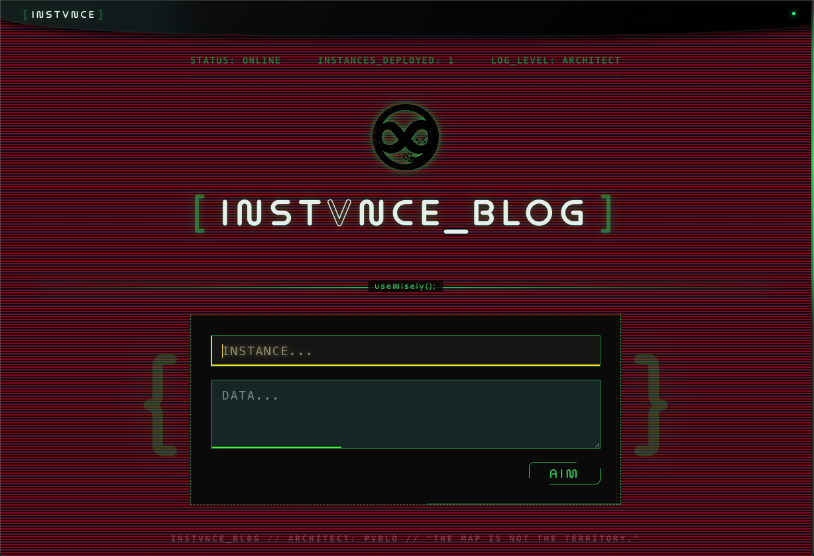
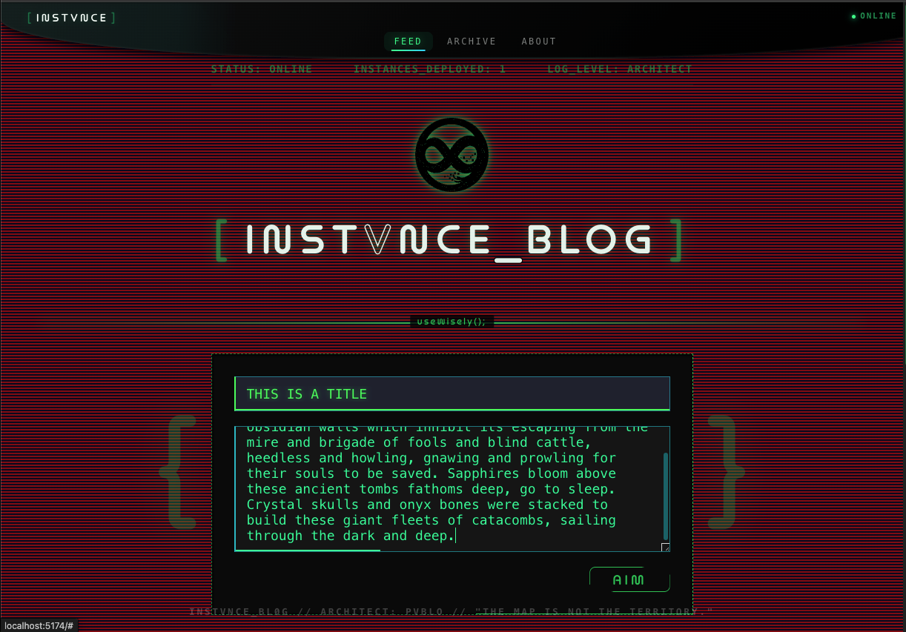
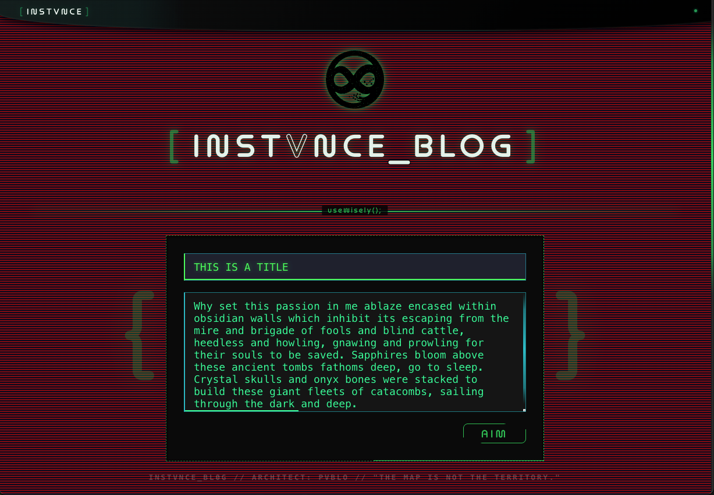
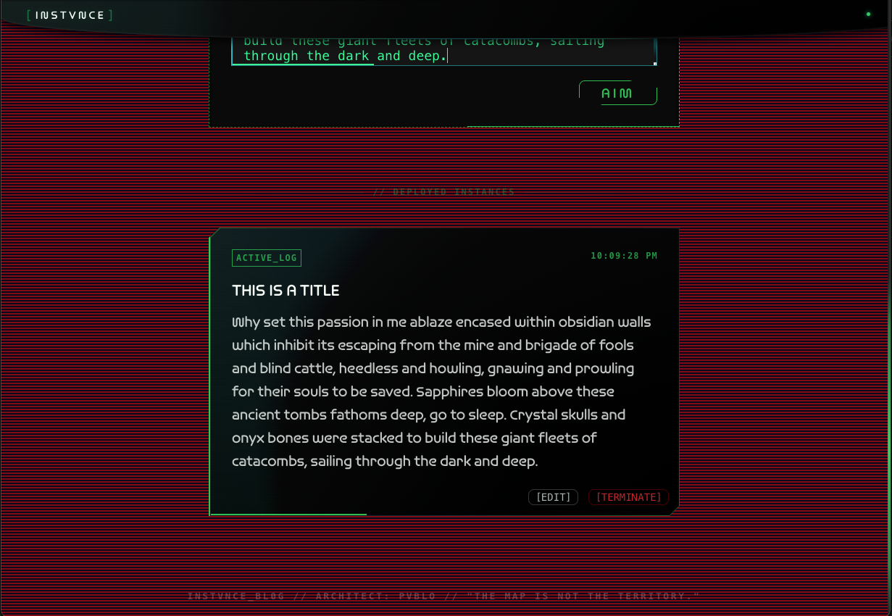

                     ██╗███╗   ██╗███████╗████████╗██╗   ██╗███╗   ██╗ ██████╗███████╗
                     ██║████╗  ██║██╔════╝╚══██╔══╝██║   ██║████╗  ██║██╔════╝██╔════╝
                     ██║██╔██╗ ██║███████╗   ██║   ██║   ██║██╔██╗ ██║██║     █████╗
                     ██║██║╚██╗██║╚════██║   ██║   ╚██╗ ██╔╝██║╚██╗██║██║     ██╔══╝
                     ██║██║ ╚████║███████║   ██║    ╚████╔╝ ██║ ╚████║╚██████╗███████╗
                     ╚═╝╚═╝  ╚═══╝╚══════╝   ╚═╝     ╚═══╝  ╚═╝  ╚═══╝ ╚═════╝╚══════╝

                             INSTVNCE_BLOG // ARCHITECT: PVBLO
                               "The map is not the territory."

---



---

# INSTVNCE_BLOG

A raw developer's log. Not a polished publication — an active terminal window into how I think, build, and decide.

---

## What it is

INSTVNCE is a **personal technical blog** built around one idea: every post is an instance — a deployed unit of thought. You write it, you fire it, you can terminate it. The interface reflects that.

The aesthetic is neopunk terminal: CRT scanline overlays, holographic post cards with chamfered corners, neon green on cosmic black, monospace everywhere. It's not decoration — it's a philosophy. The medium should feel like the work.



---

## What makes it unique

Most dev blogs look like Medium. This one looks like a monitoring dashboard.

- **The architect voice** — posts are `ACTIVE_LOG` instances. The input says `AIM`. Delete says `TERMINATE`. The tone is not content marketing; it's raw operational log.
- **CRT + holographic aesthetic** — a custom design system built from scratch: animated scanlines, clip-path chamfered cards, multi-layer holographic backgrounds, golden-ratio bottom accent lines that expand on hover.
- **Honest format** — no SEO filler, no "in this post I will". Just the thought, the decision, the thing learned.
- **Full control** — self-hosted, no CMS, no platform risk. You own every instance.



---

## Stack

| Layer | Tech |
|-------|------|
| Frontend | React + Vite |
| Styling | SCSS (custom design system) |
| Backend | Node / Express |
| Database | MongoDB |
| Font | Omnium (Adobe Fonts) |



---

## Running locally

```bash
# Backend
cd server
npm install
npm run dev   # runs on :8000

# Frontend
cd client
npm install
npm run dev   # runs on :5173
```

Requires a `.env` in `/server` with:

```
MONGO_URI=your_mongodb_connection_string
```

---

## Project structure

```
instvnce-blog/
├── client/                  # React frontend
│   └── src/
│       ├── App.jsx
│       ├── App.scss
│       └── components/
│           └── TopNav/
└── server/                  # Express API
    └── routes/
```

---

## What to write here

The blog subject is **the things you actually think about while building** — not tutorials, not explainers written for strangers. The reasoning behind choices. Things that broke and what they revealed. Mental models. Tools and philosophies worth preserving. Anything you'd want to read again in a year.

The blog is a map of the territory you're building in.

---

`STATUS: ONLINE` `INSTANCES_DEPLOYED: ACTIVE` `LOG_LEVEL: ARCHITECT`
