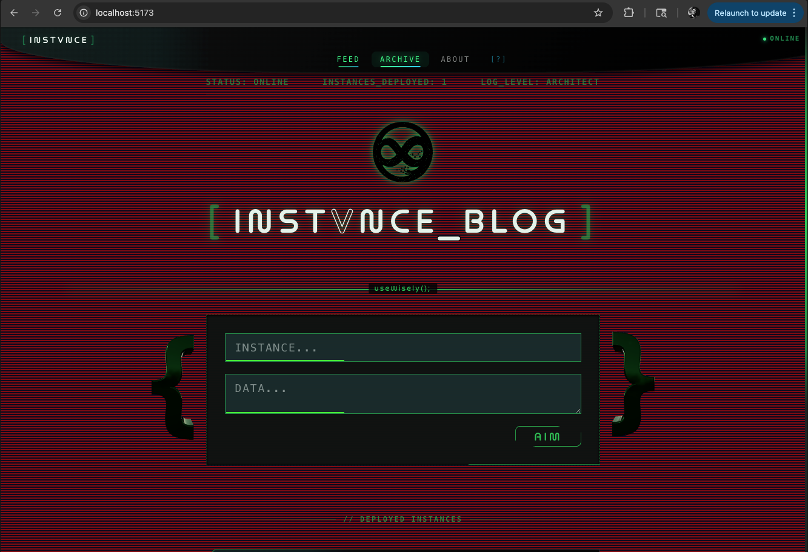
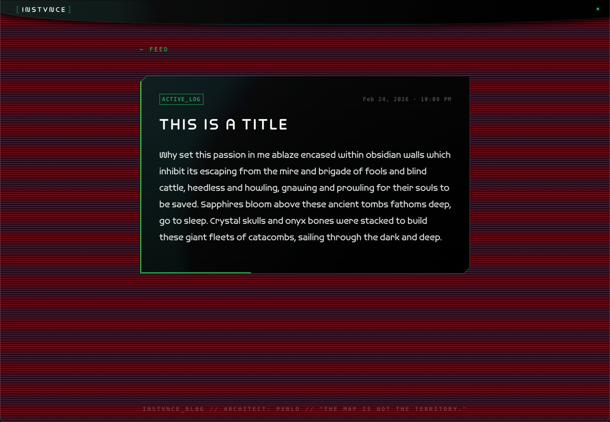

                     ██╗███╗   ██╗███████╗████████╗██╗   ██╗███╗   ██╗ ██████╗███████╗
                     ██║████╗  ██║██╔════╝╚══██╔══╝██║   ██║████╗  ██║██╔════╝██╔════╝
                     ██║██╔██╗ ██║███████╗   ██║   ██║   ██║██╔██╗ ██║██║     █████╗
                     ██║██║╚██╗██║╚════██║   ██║   ╚██╗ ██╔╝██║╚██╗██║██║     ██╔══╝
                     ██║██║ ╚████║███████║   ██║    ╚████╔╝ ██║ ╚████║╚██████╗███████╗
                     ╚═╝╚═╝  ╚═══╝╚══════╝   ╚═╝     ╚═══╝  ╚═╝  ╚═══╝ ╚═════╝╚══════╝

                             INSTVNCE_BLOG // ARCHITECT: PVBLO
                               "The map is not the territory."

---



---

# INSTVNCE_BLOG

A raw developer's log. Not a polished publication — an active terminal window into how I think, build, and decide.

---

## What it is

INSTVNCE is a **personal technical blog** built around one idea: every post is an instance — a deployed unit of thought. You write it, you fire it, you can terminate it. The interface reflects that.

The aesthetic is neopunk terminal: CRT scanline overlays, holographic post cards with chamfered corners, neon green on cosmic black, monospace everywhere. It's not decoration — it's a philosophy. The medium should feel like the work.


---

## What makes it unique

Most dev blogs look like Medium. This one looks like a monitoring dashboard.

- **The architect voice** — posts are `ACTIVE_LOG` instances. The input says `AIM`. Delete says `TERMINATE`. The tone is not content marketing; it's raw operational log.
- **CRT + holographic aesthetic** — a custom design system built from scratch: animated scanlines, clip-path chamfered cards, multi-layer holographic backgrounds, golden-ratio bottom accent lines that expand on hover.
- **Color-coded operational states** — inputs shift hue dynamically as you type. Click `[EDIT]` and the form enters heavy-load yellow: text, border, and accent line all switch to signal you're modifying something live. `AIM` morphs to `FIRE` in red on hover. Green = deploy. Yellow = modify. Red = destroy. No labels needed.


- **3D braces** — the `{ }` framing the input form are real Three.js geometry: metallic material, triple-point neon lighting, floating animation. WebGL just to frame a text input.
- **Honest format** — no SEO filler, no "in this post I will". Just the thought, the decision, the thing learned.
- **Full control** — self-hosted, no CMS, no platform risk. You own every instance.



---

## Stack

| Layer    | Tech                                   |
| -------- | -------------------------------------- |
| Frontend | React + Vite                           |
| Styling  | SCSS (custom design system)            |
| 3D       | Three.js via @react-three/fiber + drei |
| Backend  | Node / Express                         |
| Database | MongoDB                                |
| Font     | Omnium (Adobe Fonts)                   |

---

## Markdown support

Every instance supports full GFM Markdown — headings, bold, italic, links, bullet lists, blockquotes, inline code, and syntax-highlighted code blocks via `rehype-highlight`.


The `[?]` nav item opens a quick-reference modal with every supported syntax token.

![Markdown syntax reference modal — opened via the [?] nav link, lists every supported token with its rendered label, styled as a terminal read-out](client/public/screenshots/instance-markdown-info.png)

---

## Running locally

```bash
# Backend
cd server
npm install
npm run dev   # runs on :8000

# Frontend
cd client
npm install
npm run dev   # runs on :5173
```

Requires a `.env` in `/server` with:

```
MONGO_URI=your_mongodb_connection_string
```

---

## Project structure

```
instvnce-blog/
├── client/                  # React frontend
│   └── src/
│       ├── App.jsx
│       ├── App.scss
│       ├── pages/
│       │   ├── Feed.jsx
│       │   ├── PostDetail.jsx
│       │   └── About.jsx
│       ├── components/
│       │   ├── TopNav/
│       │   ├── Braces3D/
│       │   └── SyntaxModal/
│       └── styles/
└── server/                  # Express API
    └── routes/
```

---

## What to write here

The blog subject is **the things you actually think about while building** — not tutorials, not explainers written for strangers. The reasoning behind choices. Things that broke and what they revealed. Mental models. Tools and philosophies worth preserving. Anything you'd want to read again in a year.

The blog is a map of the territory you're building in.

---

## Stretch Goals

### `[?]` Raw Markdown Toggle — per post card

A small round button positioned outside and adjacent to each post card, styled with the holographic black design system (chamfered clip-path, gradient border, cosmic bg). It contains a `?` glyph.

**Behavior:**
- Clicking it toggles the post body between:
  - **Rendered view** — ReactMarkdown output (current default)
  - **Raw view** — the original markdown source, displayed in a monospace `<pre>` block with the same terminal styling as the input textarea

**Design notes:**
- Button is round, ~32px, positioned top-right outside the card boundary (absolute, negative offset)
- Active state: button glows brighter / border shifts to cyan to signal raw mode is on
- Toggle is per-card, not global — each instance manages its own view state
- No backend changes needed — `post.content` already stores the raw markdown string

---

`STATUS: ONLINE` `INSTANCES_DEPLOYED: ACTIVE` `LOG_LEVEL: ARCHITECT`
