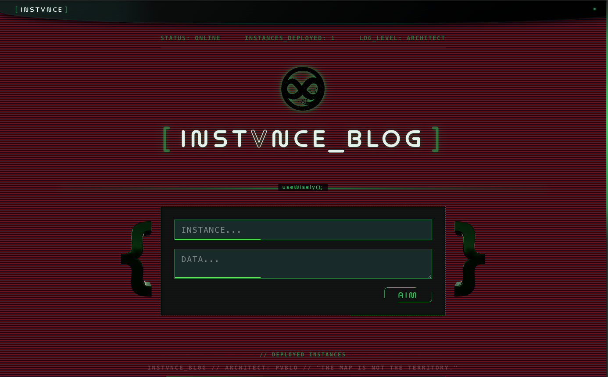
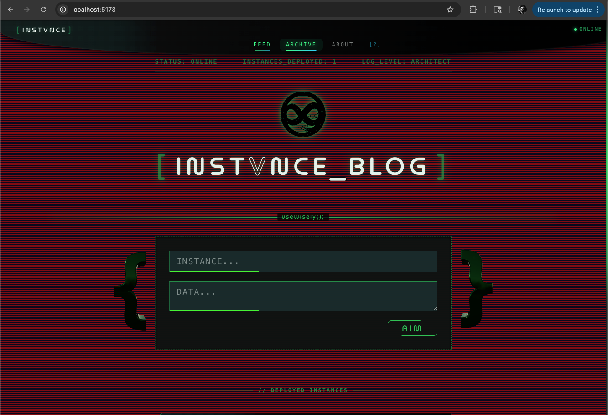
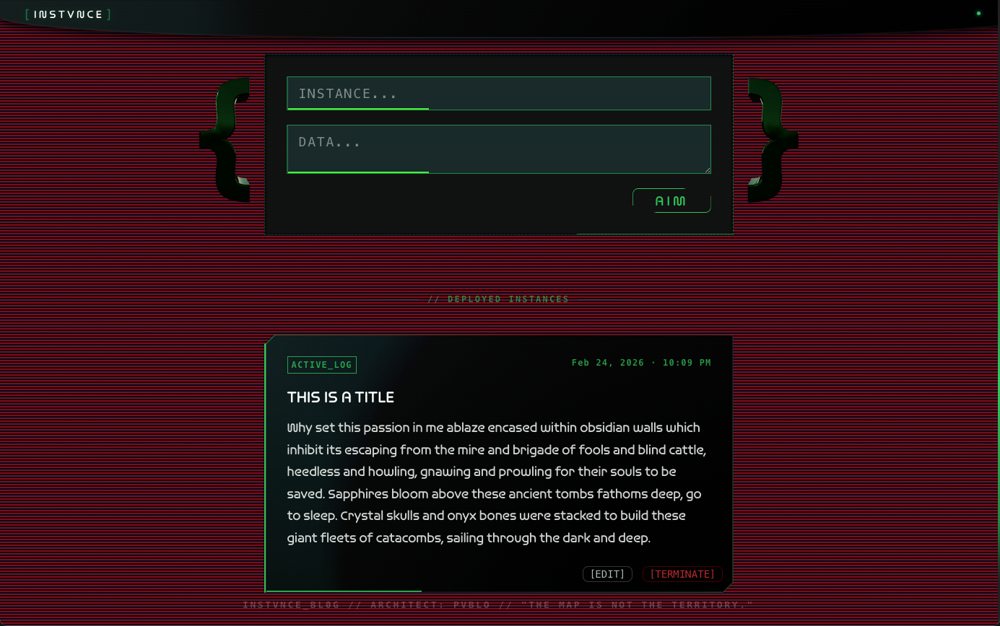
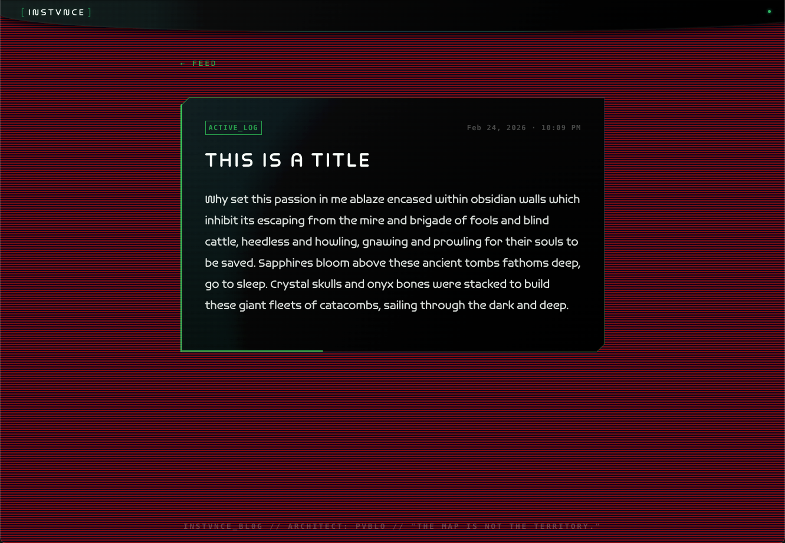
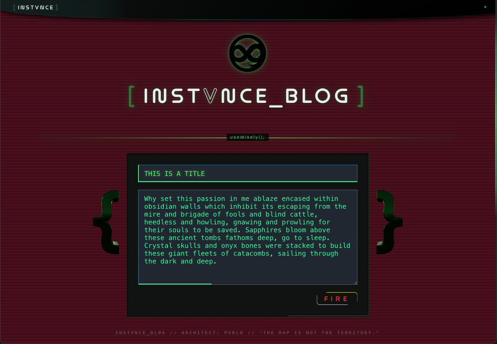
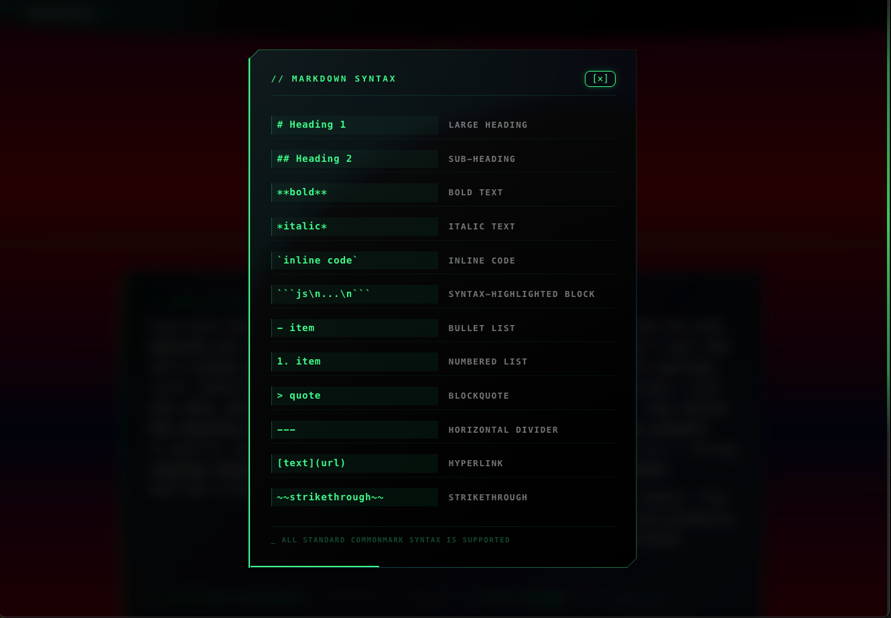
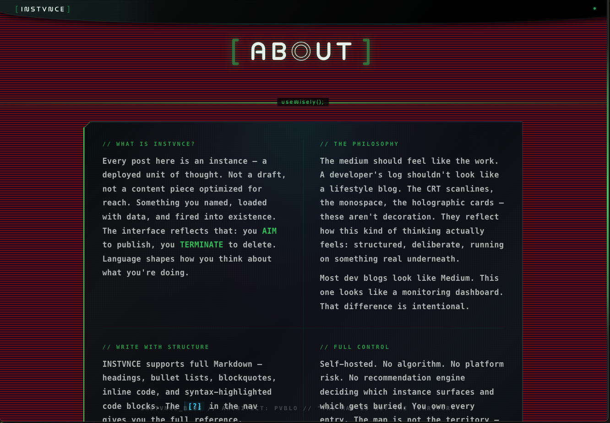

# INSTVNCE_BLOG

> _"The map is not the territory."_

A self-hosted developer blog built to feel like the work. Not a CMS, not a Medium clone — a personal deployment interface. Every post is an instance. You **AIM** to publish. You **TERMINATE** to delete. Language shapes how you think about what you're doing.



---

## What it is

INSTVNCE_BLOG is a full-stack personal blog with a cyberpunk / terminal aesthetic. CRT scanlines, holographic post cards, 3D metallic braces framing the input, monospace throughout. The interface reflects the mindset of someone who builds things — structured, deliberate, running on something real underneath.

Most dev blogs look like Medium. This one looks like a monitoring dashboard.



---

## The Interface

The home feed combines the creation form and the deployed instances in a single view. The input form is framed by floating 3D metallic `{ }` braces rendered in Three.js. The system diagnostics bar shows live instance count. Inputs shift hue dynamically as you type.



---

## Post Detail

Clicking any instance card navigates to its dedicated page — a full holographic card with the complete post content, rendered Markdown, and a `← FEED` back link.



---

## Edit Mode

Clicking `[EDIT]` on any card loads its content back into the form. The inputs shift to a **heavy-load yellow** state — a visual signal that you are modifying an existing instance, not creating a new one. The AIM button morphs to `FIRE` on hover.



---

## Markdown Support

All posts support full Markdown — headings, bullet lists, blockquotes, inline code, and syntax-highlighted code blocks. The `[?]` button in the nav opens a quick-reference modal.



---

## About

The About page explains the philosophy behind the interface — why it looks the way it does, and what self-hosting your own writing actually means.



---

## Stack

| Layer    | Tech                                      |
|----------|-------------------------------------------|
| Frontend | React 18 + Vite                           |
| Styling  | SCSS (modular partials)                   |
| 3D       | Three.js via @react-three/fiber + drei    |
| Markdown | react-markdown + rehype-highlight         |
| Routing  | React Router v6                           |
| Backend  | Express.js                                |
| Database | MongoDB + Mongoose                        |

---

## Running locally

```bash
# Backend
cd server && npm install && npm start

# Frontend
cd client && npm install && npm run dev
```

Requires a `.env` in `/server` with:

```
MONGO_URI=your_mongodb_connection_string
PORT=8000
```
